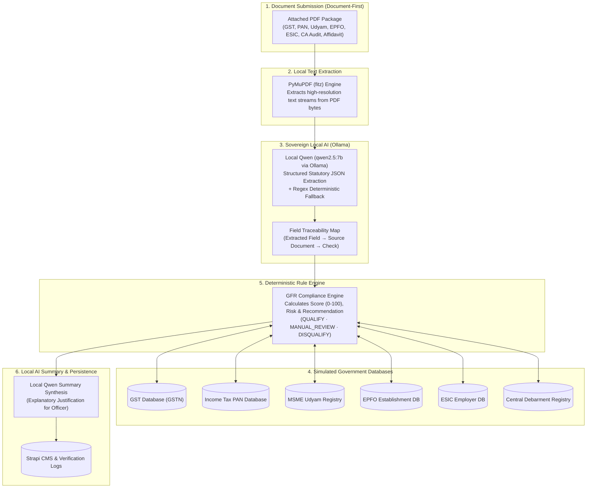

# BidSetu — AI-Powered Bidder Verification Platform
> **Smart India Hackathon (SIH26100)** · Automated Government Procurement Tender Scrutiny, Document-First Multi-Registry Verification, and Local-AI Risk Assessment.

---

## 📑 Table of Contents
1. [The Problem & The Solution](#-the-problem--the-solution)
2. [Document-First & Local-AI Architecture](#-document-first--local-ai-architecture)
3. [Technology Stack](#-technology-stack)
4. [Verification Pipeline & Data Flow](#-verification-pipeline--data-flow)
5. [Synthetic Evaluation Dataset (3 Demo Bidders)](#-synthetic-evaluation-dataset-3-demo-bidders)
6. [Simulated Statutory Registries](#-simulated-statutory-registries)
7. [Developer Console & Pipeline Diagnostics](#-developer-console--pipeline-diagnostics)
8. [Quick Start Guide (Docker & Local)](#-quick-start-guide-docker--local)
9. [Local Ollama Setup (qwen2.5:7b)](#-local-ollama-setup-qwen257b)
10. [Repository Structure](#-repository-structure)

---

## 🎯 The Problem & The Solution

### ❌ The Problem
In public procurement (**GeM - Government e-Marketplace**, **CPPP**, State e-Procurement):
- **Weeks of Manual Document Scrutiny**: Technical and legal evaluation of hundreds of bidder applications requires manually downloading and reading dozens of statutory certificates per bidder.
- **Manual Data Entry Vulnerabilities**: In legacy systems, bidders self-report GSTIN, PAN, and Udyam numbers on web forms, creating discrepancies between entered text and submitted PDF documents.
- **Fragmented Portals**: Procurement officers must manually log into 8+ disparate government portals (GSTN, Traces/Income Tax, Udyam, EPFO Shram Suvidha, ESIC, DPIIT, NSIC, Central Debarment registers) for every single bidder.
- **Data Privacy & Air-Gap Requirements**: Sensitive procurement tenders (defense, atomic energy, infrastructure) cannot send confidential bidder filings or proprietary certificates to external cloud AI APIs.

### ✅ The Solution: BidSetu
BidSetu is an autonomous, **DOCUMENT-FIRST** and **LOCAL-AI ONLY** verification platform:
1. **Document-First Extraction**: Bidders do not type statutory credentials. Instead, certificates (GST, PAN, Udyam, EPFO, ESIC, Financial Audits, Non-Blacklisting Affidavits) are uploaded as PDFs.
2. **Local AI Parsing with PyMuPDF & Qwen**: PyMuPDF extracts raw text from PDF bytes; local Qwen (`qwen2.5:7b` running via Ollama) extracts structured statutory credentials with complete document traceability.
3. **Instant Multi-Registry Cross-Examination**: Programmatically queries all 8 simulated statutory databases using extracted values.
4. **Deterministic Rule Engine**: Evaluates statutory compliance using hardcoded legal rules (not probabilistic LLM guesses), calculating an objective Compliance Score (0–100) and Risk Tier (Low, Medium, High, Critical).
5. **Local AI Summary Synthesis**: Local Qwen synthesizes a concise, legally sound explanatory summary for the procurement officer.
6. **In-App Document Preview Modal**: Officers can click any extracted credential or source document to view the authentic statutory PDF directly within the application.
7. **Immutable Audit Trail**: Chronologically logs every extraction event, database check, score calculation, and officer sign-off in Strapi `verification-logs`.

---

## 🔒 Document-First & Local-AI Architecture



---

## 💻 Technology Stack

The platform is engineered as a decoupled, multi-tier microservices architecture:

### 1. Frontend Layer (Next.js & UI Architecture)
- **Framework**: **Next.js 16 (Turbopack, App Router)** with dynamic Route Handlers and Server Components.
- **Library**: **React 19** with client-side state hooks.
- **Styling & Design System**: **Tailwind CSS v4** with PostCSS and responsive layout utilities.
- **Animations & Interaction**: **Framer Motion 12** powering the 15-step live scanner overlay and document preview modal.
- **State Management**: **Zustand 5** for officer state, filters, and active bidder context.
- **In-App Document Viewer**: Next.js proxy route `/api/uploads/[...path]` serving uploaded PDFs with `application/pdf` streaming and iframe modal viewer.

### 2. Backend & CMS Layer (Strapi v5)
- **Platform**: **Strapi v5 (Headless CMS)** running on Node.js 20.
- **Database**: **SQLite (`better-sqlite3`)** embedded relational database.
- **Media Library**: Strapi Upload plugin storing submitted bidder certificate PDFs.
- **Content Collections**:
  - `tenders`: Tender metadata, codes, departments, categories, closing dates, estimated value.
  - `bidder-applications`: Bidder details, attached PDF documents, `extractedData` JSON payload with traceability, status, scores.
  - `verification-logs`: Immutable chronological log of verification events and officer decisions.
  - **Simulated Statutory Registries**: Dedicated schemas for `gst-databases`, `pan-databases`, `udyam-databases`, `epfo-databases`, `esic-databases`, `startup-india-databases`, `nsic-databases`, and `blacklist-databases`.

### 3. AI & Verification Microservice Layer (Python & FastAPI)
- **Framework**: **Python 3.11** + **FastAPI** + **Uvicorn** (asynchronous ASGI server on port 8000).
- **PDF Engine**: **PyMuPDF (`pymupdf`/`fitz`)** for programmatic text and layout parsing.
- **Local LLM Engine**: **Ollama** running locally on host (`http://host.docker.internal:11434`) using **`qwen2.5:7b`**.
- **Rule Engine**: Deterministic Python logic implementing Ministry of Finance General Financial Rules (GFR).
- **Data Privacy**: **Zero cloud AI dependencies** — zero tokens or documents sent outside the local environment.

---

## 📊 Synthetic Evaluation Dataset (3 Demo Bidders)

The repository includes a synthetic test package under Tender **`TDR-2026-001`** (*Supply, Testing and Commissioning of 33/11kV Electrical Substation Equipment*):

| Bidder | Submitted Documents | Compliance Highlights | Expected Verdict | Score |
|---|---|---|---|---|
| **Apex Electricals & Power Infrastructure Pvt Ltd** | 7 PDFs: GST, PAN, Udyam, EPFO, ESIC, CA Audited Turnover (₹18.45 Cr), Non-Blacklisting Affidavit | Active GST, Recent returns, Valid PAN, Medium Enterprise Udyam, 85 EPFO/ESIC members, Clean Debarment | **QUALIFY** | **100 / 100** (Low Risk) |
| **Nova Energy & Engineering Systems LLP** | 7 PDFs: GST, PAN, Udyam, EPFO, ESIC, CA Audited Financials (₹6.25 Cr), Non-Blacklisting Affidavit | Active GST, Valid PAN, Small Enterprise Udyam, Compliant EPFO (28 members), ESIC branch record mismatch | **MANUAL_REVIEW** | **94 / 100** (Low Risk, Review flagged) |
| **Vanguard Infra Projects Pvt Ltd** | 7 PDFs: GST, PAN, Udyam, EPFO, ITR-V, Turnover Statement (₹2.1 Cr), Debarment Declaration | Cancelled GSTIN (Sec 29 non-filing), Defaulting EPFO, Deficit turnover, Active Debarment Ban in Blacklist DB | **DISQUALIFY** | **0 / 100** (Critical Risk) |

---

## 🛠️ Developer Console & Pipeline Diagnostics

### 1. 15-Step Real-Time Live Overlay
When an officer triggers verification, the UI displays a 15-step progress overlay:
1. Loading attached bidder documents from Strapi
2. Parsing document bytes via PyMuPDF
3. Running Local Qwen (`qwen2.5:7b`) for statutory JSON extraction
4. Correlating extracted GSTIN, PAN, Udyam, EPFO, ESIC
5. Checking GST status & filing recency against GSTN
6. Cross-referencing PAN against Income Tax database
7. Verifying MSME registration & classification
8. Validating EPFO labor compliance & contribution recency
9. Checking ESIC social security registration
10. Querying Startup India (DPIIT) registry
11. Querying NSIC single-point registration
12. Scanning Central Debarment / Blacklist registry
13. Running deterministic GFR scoring engine
14. Generating explanatory AI summary via Local Qwen
15. Persisting audit log and verification result to Strapi

### 2. Extracted Credentials & Traceability Card
In the Bidder Detail view, an **Extracted Credentials** card displays each detected credential with its source document name. Clicking on the source document immediately opens the authentic certificate in the in-app PDF preview modal.

---

## 🚀 Quick Start Guide (Docker & Local)

### Option 1: Docker Compose (Recommended)

```powershell
# 1. Start Docker containers
docker compose up -d

# 2. Run the synthetic bidder & document seed script
python backend/scripts/seed_demo_bidders.py

# 3. Open the platform in your browser
http://localhost:3000
```

### Option 2: 1-Click Windows Launch
Double-click **`start-all.bat`** in the root directory. To stop all services cleanly, double-click **`stop-all.bat`**.

---

## 🦙 Local Ollama Setup (qwen2.5:7b)

1. Download and install Ollama from [ollama.com](https://ollama.com).
2. Pull the Qwen model:
   ```bash
   ollama pull qwen2.5:7b
   ```
3. Start the Ollama server:
   ```bash
   ollama serve
   ```
4. Verify accessibility:
   ```bash
   curl http://localhost:11434/api/tags
   ```

---

## 📁 Repository Structure

```
Ge-compliance-platform/
├── ai-worker/                      # Python FastAPI Local AI Verification Worker
│   ├── document_extractor.py       # PyMuPDF text parser + Local Qwen JSON extractor
│   ├── verification_pipeline.py    # 15-step document-first verification orchestrator
│   ├── rule_engine.py              # Deterministic statutory scoring & risk engine
│   ├── strapi_client.py            # Strapi v5 REST client with documentId resolution
│   ├── main.py                     # FastAPI server with SSE log streams & endpoints
│   └── requirements.txt            # Python dependencies (pymupdf, ollama, fastapi)
├── backend/                        # Strapi v5 Headless CMS & Database
│   ├── scripts/
│   │   └── seed_demo_bidders.py    # Generates 21 statutory PDFs & seeds registries
│   ├── src/api/                    # Content-types (bidders, tenders, 8 registries)
│   └── Dockerfile
├── frontend/                       # Next.js 16 Web Application
│   ├── src/
│   │   ├── app/                    # App Router pages & API proxy routes
│   │   ├── components/atc/         # Scrutiny workbench, scanner overlay, PDF modal
│   │   └── lib/                    # Strapi client, store, and data contracts
│   └── Dockerfile
├── docker-compose.yml              # Multi-container orchestration
└── README.md
```